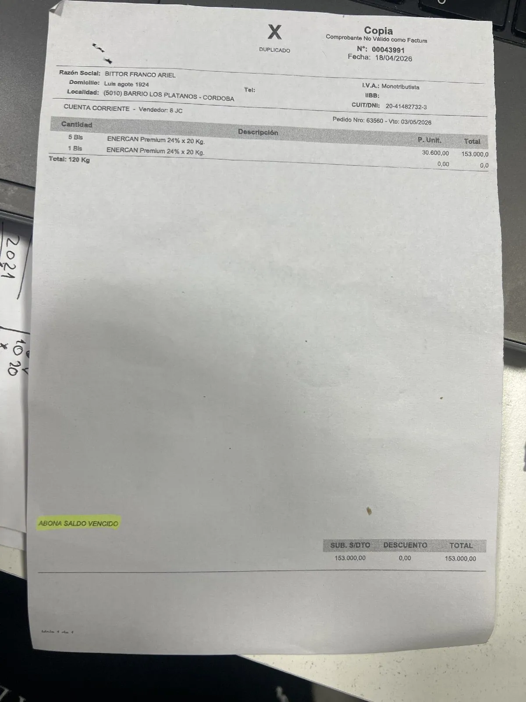

# AI Invoice Scanner — Two-Pass Matching

Scanning a supplier purchase invoice ("Factura de Compra") uses Gemini to extract line items and match them against the product catalog. The flow lives in `api/controllers/scan-invoice.php` and is consumed by `admin/components/Inventory/SupplierPurchaseModal.vue` via `admin/composables/useInvoiceScan.ts`.

Read this file **before** changing any AI prompt, catalog payload, filter logic, or normalization helper in that flow. Every rule below was added in response to a real failure on a real invoice — reverting one silently brings back a specific class of bug.

---

## Why two passes

The naive approach — ship the entire catalog to Gemini in one call and ask for `productId` per line — is what we used to do, and it produced cross-brand hallucinations with high confidence. A real example: an invoice line reading `ENERCAN Premium 24% x 20 Kg` was matched to `SIEGER SENIOR SMALL MINI+7 3kg` at 80% confidence, because ENERCAN wasn't in the catalog and Gemini "helpfully" picked the closest dog-food product regardless of brand or weight.

The two-pass design makes cross-brand matching physically impossible, not just discouraged:

1. **Pass 1 (AI)** — extract line items from the image. Only a **closed brand list** is sent (no catalog), so Gemini cannot pick a product at all. It returns `rawText`, `quantity`, `unitCost`, `brandMatch` (from the closed list or null), `weightKg` (normalized to kg or null), plus invoice header fields.
2. **Server filter** — per line, narrow the catalog to a shortlist using hard gates: brand must match, and when a weight is detected on the invoice line, the product's weight must match (±0.1 kg tolerance).
3. **Pass 2 (AI, conditional)** — only runs when at least one line has 2+ candidates. Feeds the image again plus per-line shortlists with strict "pick from this shortlist or return null" rules. The server then validates the returned `productId` is actually in the shortlist and zeros it if not.

Deterministic cases skip Pass 2 entirely:
- 0 candidates → `productId: null`, confidence `0.0` (surfaces as red "Producto no identificado")
- 1 candidate → auto-match, confidence `1.0` (surfaces as green "IA · 100%")

---

## Reference invoice

`assets/invoice-enercan-sample.webp` is the sample invoice that drove the rewrite. Keep it around — it exercises three of the four documented edge cases at once.



Transcribed:
```
5 Bls   ENERCAN Premium 24% x 20 Kg.              P.Unit 30.600,00   Total 153.000,00
1 Bls   ENERCAN Premium 24% x 20 Kg.              P.Unit 30.600,00   Total       0,00   (bonus)
Total 120 Kg                                                         SubTotal 153.000,00
```

When testing changes to the scanner, try this invoice first.

---

## Known edge cases (and why the code looks the way it does)

### 1. Cross-brand hallucination at high confidence

**Symptom (pre-rewrite):** ENERCAN 20 Kg matched to SIEGER 3 kg at 80% confidence.

**Defense:** the full catalog is never shipped to Gemini. Pass 1 only sees a closed brand list, and Pass 2 only sees per-line shortlists that already passed the brand gate. Even if Gemini hallucinates a `productId` in Pass 2, the server rejects any id not present in that line's shortlist (`scan-invoice.php`, off-shortlist guard).

**Don't:** add the full catalog to any prompt. Don't weaken the shortlist validation.

### 2. OCR-hallucinated accents / cedillas (`ENERÇAN` case)

**Symptom:** Gemini OCR'd the invoice word `ENERCAN` as `ENERÇAN` (C-cedilla, `U+00C7`). A naïve literal comparison against the brand list `["Enercan"]` returns no match, so Pass 1 emits `brandMatch: null`.

**Defense (two layers):**
- Pass 1 prompt explicitly instructs Gemini to ignore case, accents, tildes, and cedillas when comparing invoice text to the closed brand list. `ENERÇAN` → `Enercan` happens at the AI step.
- Server fallback `matchBrandInText()` in `api/includes/helpers.php` normalizes both sides via `iconv(UTF-8 → ASCII//TRANSLIT//IGNORE)` and does a whole-word regex match. Catches cases the AI missed.

**Don't:** remove the transliteration step in `normalizeText()`. Don't assume OCR will give clean ASCII — invoices are printed on crumpled paper with staples, coffee rings, and highlighter.

### 3. `unit`-tracked products with no `unitWeight` field

**Symptom:** ENERCAN 20 Kg invoice line filtered out entirely, even though the matching product existed.

**Root cause:** `ProductSchema` only requires `unitWeight` for `dual` tracking. Single-SKU bags tracked as `unit` typically have `unitWeight` empty and encode the weight in the product name (`ENERCAN - PERRO ADULTO MEDIANO Y GRANDE - 20KG`). A strict weight gate that required `unitWeightKg` to be present dropped the product.

**Defense:** the weight gate in `filterCandidates()` now falls back to `extractWeightKg($p['name'])` when `unitWeightKg` is absent. If neither source produces a weight, the product is kept — we cannot disprove the match with no data, and the brand gate already narrowed the set.

**Don't:** require `unitWeightKg` to be populated to match. Don't silently drop products whose weight is only in the name.

### 4. Bonus / free product lines (same product twice) — OPEN

**Symptom:** the reference invoice has the same ENERCAN product listed twice — 5 paid bags, then 1 bonus bag at price 0. Pass 1 is intentionally told to return both as separate lines (see the prompt comment: "SI el mismo producto aparece en dos líneas... DEVOLVÉ LAS DOS"). The frontend then shows two rows with the same product, which the user has to merge manually.

**Status:** intentionally left to a follow-up. When it's implemented, the merge should happen on the server after Pass 2 resolves `productId`s — combining lines by `productId` and computing an effective unit cost (`sum(totals) / sum(quantities)`) so inventory reflects the real received quantity and accounting reflects the real effective cost per unit.

**Don't:** merge in Pass 1. Gemini shouldn't have to reason about business semantics — let it extract lines verbatim and apply the merge deterministically on the server.

---

## Catalog payload discipline

The catalog shipped to shortlists (Pass 2 only) includes: `id`, `name`, `brand`, `code`, `unitType`, `trackingType`, `unitWeightKg`, `description`, `subcategory`. The brand list shipped to Pass 1 is just the distinct non-empty brands from the catalog, case/accent-deduped via `distinctBrands()`.

Things deliberately excluded from prompts:
- Prices, stock levels, supplier IDs — irrelevant for matching, wastes tokens.
- The full catalog in Pass 1 — reintroducing it resurrects the hallucination problem.

If a new product field would help disambiguation (e.g. protein %, life stage as a structured field), add it to the catalog entry builder in `scan-invoice.php` and the `$shortlistFields` array, not to Pass 1.

---

## Key files

- `api/controllers/scan-invoice.php` — two-pass orchestration, prompts, schemas, filter.
- `api/includes/helpers.php` — `normalizeText`, `extractWeightKg`, `matchBrandInText`, `distinctBrands`, `parseLocalizedAmount`, `parseInvoiceDate`.
- `api/includes/GeminiHandler.php` — stateless `generateStructured()` with per-day model rotation.
- `admin/composables/useInvoiceScan.ts` — client-side call wrapper.
- `admin/components/Inventory/SupplierPurchaseModal.vue` — consumer (`applyScanResult`), confidence badge rendering, unmatched-row treatment.

---

## Before you change anything here

Minimum verification when touching this flow:

1. Rerun the reference invoice (`assets/invoice-enercan-sample.webp`) end-to-end. Expected: two lines, both auto-matched to the ENERCAN 20 Kg product at 100% confidence, both shown with raw text preserved.
2. Confirm cross-brand rejection: craft or use an invoice line for a brand that does not exist in the catalog. Expected: `productId: null`, red "Producto no identificado" block, invoice raw text visible.
3. Confirm wrong-weight rejection: right brand, wrong weight (e.g. an ENERCAN 7,5 kg line when only a 20 kg product exists). Expected: `productId: null` rather than matching the 20 kg bag.
4. Check Gemini rotation still works when you add a new model to `GEMINI_MODELS` — a stale exhausted map in `api/tmp/gemini-exhausted.json` can mask a broken model for up to a day.
