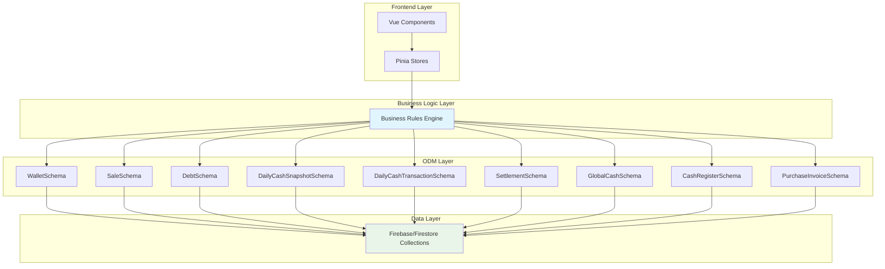
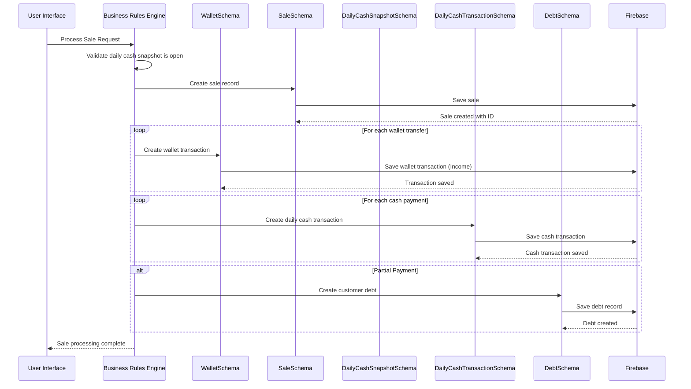
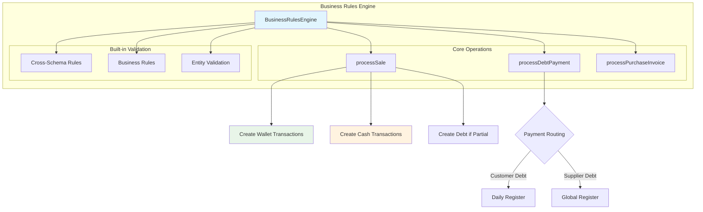
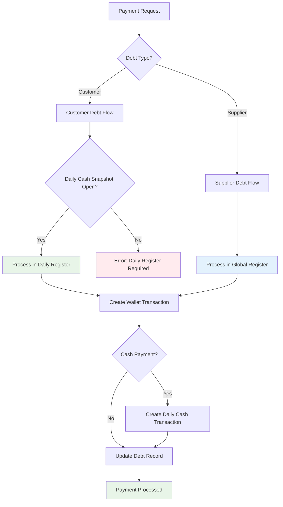
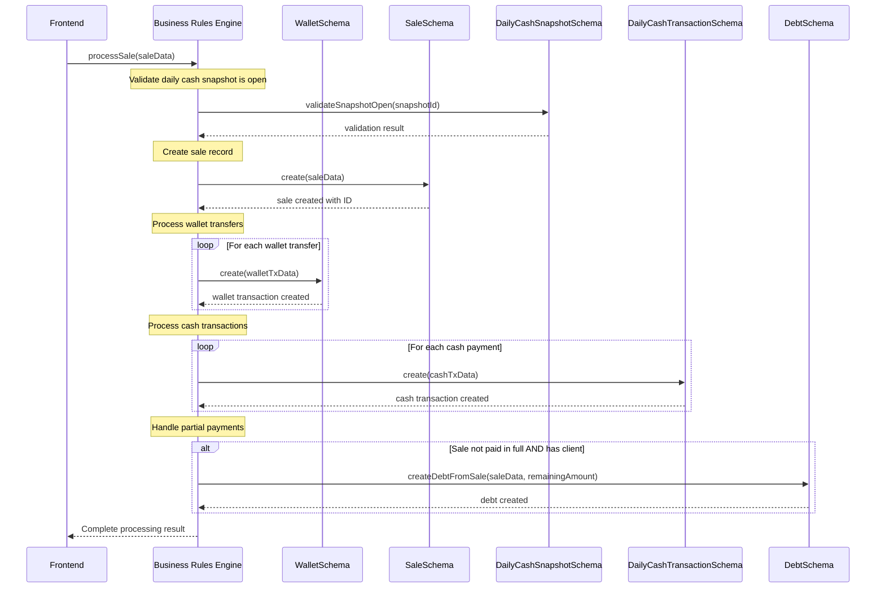
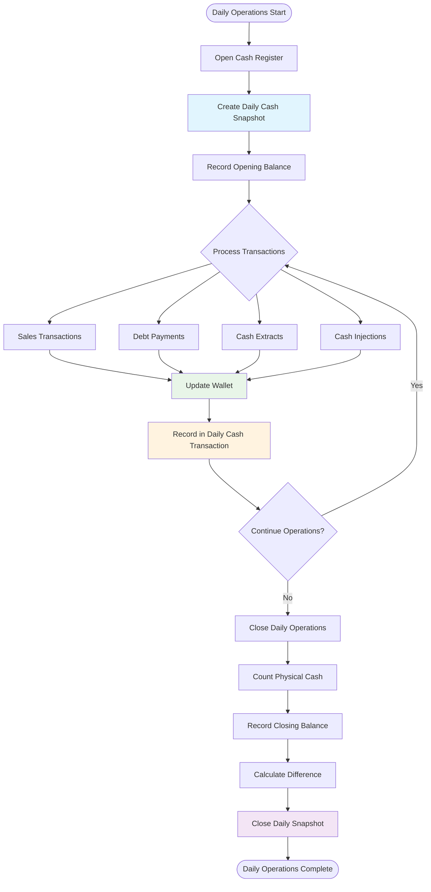
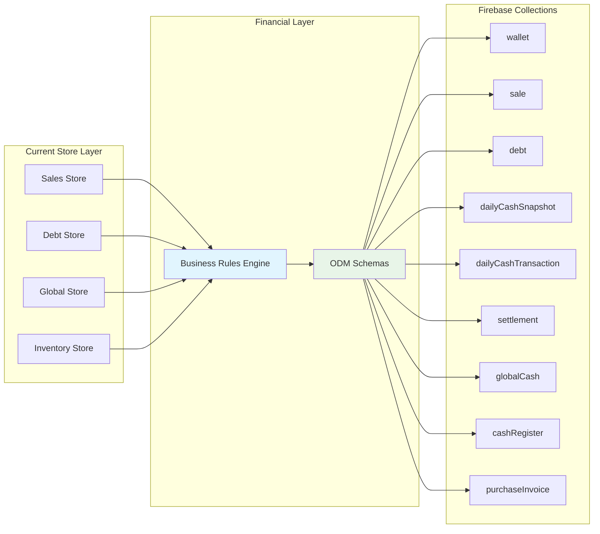
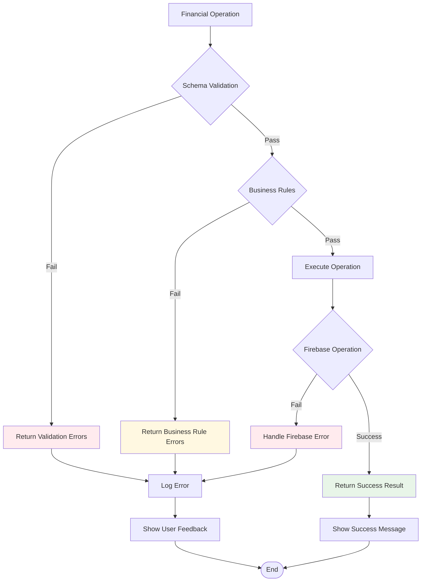

# Pet Universe Financial Architecture - Schema-Based System

This document provides comprehensive documentation for the Pet Universe financial architecture, including collection structures, data flow, and business rules implementation using ODM schemas.

## 1. System Overview



## 2. Collection Architecture

### Core Collections and Their Schemas

| Collection Name | Schema File | Purpose | Key Features |
|----------------|-------------|---------|--------------|
| `wallet` | WalletSchema.ts | Central transaction ledger | Immutable transactions, balance tracking |
| `sale` | SaleSchema.ts | Sales transactions | Inventory integration, wallet transfers |
| `debt` | DebtSchema.ts | Customer/supplier debts | Status tracking, payment recording |
| `dailyCashSnapshot` | DailyCashSnapshotSchema.ts | Daily register sessions | Opening/closing balances |
| `dailyCashTransaction` | DailyCashTransactionSchema.ts | Cash-only transactions | Sales, debt payments, extracts |
| `settlement` | SettlementSchema.ts | Postnet payment lifecycle | Fee calculations, status transitions |
| `globalCash` | GlobalCashSchema.ts | Weekly business register | Cross-payment-method balances |
| `cashRegister` | CashRegisterSchema.ts | Physical register definitions | Activation/deactivation management |
| `purchaseInvoice` | purchaseInvoiceSchema.ts | Supplier invoices | Status transitions, wallet integration |

## 3. Central Wallet System - Transaction Flow



## 4. Database Schema Relationships

```mermaid
erDiagram
    wallet {
        string id PK
        string businessId FK
        string type "Income|Outcome"
        number amount
        string description
        string category
        string relatedEntityType
        string relatedEntityId FK
        string paymentMethod
        string status "active|cancelled"
        timestamp createdAt
        string createdBy
        string createdByName
    }
    
    sale {
        string id PK
        string businessId FK
        string dailyCashSnapshotId FK
        string cashRegisterId FK
        string saleNumber
        string clientId FK "nullable"
        string clientName "nullable"
        array items
        array wallets
        number amountSubtotal
        number discountTotal
        number amountTotal
        boolean isPaidInFull
        string debtId FK "nullable"
        string settlementId FK "nullable"
        boolean inventoryUpdated
        timestamp createdAt
        string createdBy
        string createdByName
    }
    
    debt {
        string id PK
        string businessId FK
        string clientId FK "nullable"
        string clientName "nullable"
        string supplierId FK "nullable"
        string supplierName "nullable"
        string dailyCashSnapshotId FK "nullable"
        string cashRegisterId FK "nullable"
        string cashRegisterName "nullable"
        number originalAmount
        number paidAmount
        number remainingAmount
        string originType "sale|purchaseInvoice|manual"
        string originId FK "nullable"
        string status "active|paid|cancelled"
        timestamp dueDate "nullable"
        timestamp createdAt
        string createdBy
        string createdByName
        timestamp paidAt "nullable"
        timestamp cancelledAt "nullable"
        string cancelledBy "nullable"
        string cancelReason "nullable"
    }
    
    dailyCashSnapshot {
        string id PK
        string businessId FK
        string cashRegisterId FK
        string cashRegisterName
        number openingBalance
        number closingBalance "nullable"
        number difference "nullable"
        string status "open|closed"
        timestamp openedAt
        string openedBy
        string openedByName
        timestamp closedAt "nullable"
        string closedBy "nullable"
        string closedByName "nullable"
        array transactions
        object summary
    }
    
    dailyCashTransaction {
        string id PK
        string businessId FK
        string dailyCashSnapshotId FK
        string cashRegisterId FK
        string cashRegisterName
        string type "sale|debt_payment|extract|inject"
        number amount
        string description
        string relatedEntityType "nullable"
        string relatedEntityId FK "nullable"
        string notes
        timestamp createdAt
        string createdBy
        string createdByName
    }
    
    settlement {
        string id PK
        string businessId FK
        string saleId FK
        string dailyCashSnapshotId FK "nullable"
        string cashRegisterId FK "nullable"
        string cashRegisterName "nullable"
        number amount
        number feeAmount
        string status "pending|settled|cancelled"
        timestamp expectedSettlementDate "nullable"
        timestamp settledAt "nullable"
        string settledBy "nullable"
        string settledByName "nullable"
        timestamp cancelledAt "nullable"
        string cancelledBy "nullable"
        string cancelReason "nullable"
        timestamp createdAt
        string createdBy
        string createdByName
    }
    
    globalCash {
        string id PK
        string businessId FK
        object openingBalances
        object closingBalances "nullable"
        object differences "nullable"
        string status "open|closed"
        timestamp openedAt
        string openedBy
        string openedByName
        timestamp closedAt "nullable"
        string closedBy "nullable"
        string closedByName "nullable"
        array transactions
        object summary
    }
    
    cashRegister {
        string id PK
        string businessId FK
        string name
        boolean isActive
        timestamp createdAt
        string createdBy
        string createdByName
        timestamp deactivatedAt "nullable"
        string deactivatedBy "nullable"
        string deactivatedByName "nullable"
    }
    
    purchaseInvoice {
        string id PK
        string businessId FK
        string supplierId FK
        string supplierName
        string invoiceNumber
        number amountSubtotal
        number amountAdditional
        number amountTotal
        string paymentMethod
        boolean isPaidInFull
        string status "pending|paid|cancelled"
        timestamp dueDate "nullable"
        timestamp createdAt
        string createdBy
        string createdByName
        timestamp paidAt "nullable"
        timestamp cancelledAt "nullable"
        string cancelledBy "nullable"
        string cancelReason "nullable"
    }
    
    %% Relationships
    wallet ||--o{ sale : "tracks sale payments"
    wallet ||--o{ debt : "tracks debt payments"
    wallet ||--o{ purchaseInvoice : "tracks purchase payments"
    
    sale ||--o| debt : "may create debt"
    sale ||--o| settlement : "may have settlement"
    sale }o--|| dailyCashSnapshot : "processed in snapshot"
    
    debt }o--|| dailyCashSnapshot : "customer debts link to snapshot"
    
    dailyCashSnapshot ||--o{ dailyCashTransaction : "contains transactions"
    dailyCashSnapshot }o--|| cashRegister : "belongs to register"
    
    settlement }o--|| dailyCashSnapshot : "settlements link to snapshot"
    
    globalCash ||--o{ wallet : "summarizes wallet transactions"
    
    cashRegister ||--o{ dailyCashSnapshot : "has daily snapshots"
```



## 5. Business Rules Engine Architecture



## 6. Smart Payment Routing System



## 7. Sale Processing with Wallet Integration



## 8. Daily Cash Management Workflow



## 9. Schema Validation and Business Rules

### Key Validation Rules Across Schemas

#### WalletSchema
- Immutable transactions (no updates after creation)
- Amount must be positive with max 2 decimal places
- Status transitions: active → cancelled (one-way)
- Required audit trail fields

#### SaleSchema
- Wallet transfers must sum to paid amount
- Daily cash snapshot must be open
- Inventory update validation
- Price calculation consistency

#### DebtSchema
- Either clientId OR supplierId required (not both)
- Amount consistency: originalAmount = paidAmount + remainingAmount
- Customer debts must reference daily cash snapshot
- Supplier debts should not reference daily cash snapshot

#### DailyCashSnapshotSchema
- Only one open snapshot per cash register
- Opening balance from previous snapshot's closing balance
- Transaction totals must match balance changes

### Business Rule Examples

```typescript
// Example: Sale processing with wallet integration
const saleProcessingRules = {
  validateWalletTransfers: (saleData) => {
    const walletTotal = saleData.wallets.reduce((sum, w) => sum + w.amount, 0);
    const expectedPaid = saleData.amountTotal - (saleData.debtAmount || 0);
    return Math.abs(walletTotal - expectedPaid) <= 0.01;
  },
  
  routeDebtPayment: (debt) => {
    // Customer debts → Daily register
    // Supplier debts → Global register
    return debt.clientId ? 'daily' : 'global';
  },
  
  validateCashOperations: (amount, currentBalance, operation) => {
    if (operation === 'extract' && amount > currentBalance) {
      throw new Error('Insufficient cash balance for extraction');
    }
  }
};
```

## 10. Integration with Existing System



## 11. Error Handling and Validation Flow



## Key Benefits of the New Architecture

### 🎯 **Centralized Transaction Management**
- All financial transactions flow through the `wallet` collection
- Single source of truth for monetary movements
- Immutable audit trail for all transactions

### 💰 **Unified Cash Management**
- Daily cash snapshots for operational management  
- Global cash register for weekly business overview
- Automatic balance calculations and discrepancy tracking

### 🔄 **Smart Debt Management**
- Automatic debt creation for partial payments
- Smart routing: customer debts → daily register, supplier debts → global register
- Status tracking and payment recording with full audit trail

### 🏗️ **Schema-Driven Architecture**
- All collections managed through ODM schemas with validation
- Consistent error handling and business rule enforcement
- Automatic audit trail and business context injection

### 📊 **Enhanced Financial Reporting**
- Real-time balance calculations across all payment methods
- Comprehensive financial summaries and integrity checks
- Settlement tracking for postnet/card payments with fee management

### 🔐 **Data Integrity**
- Cross-schema validation rules
- Immutable transaction records
- Automatic consistency checks and error reporting

This architecture provides a robust, scalable foundation for Pet Universe's financial operations while maintaining data integrity and providing comprehensive audit trails for all monetary transactions.